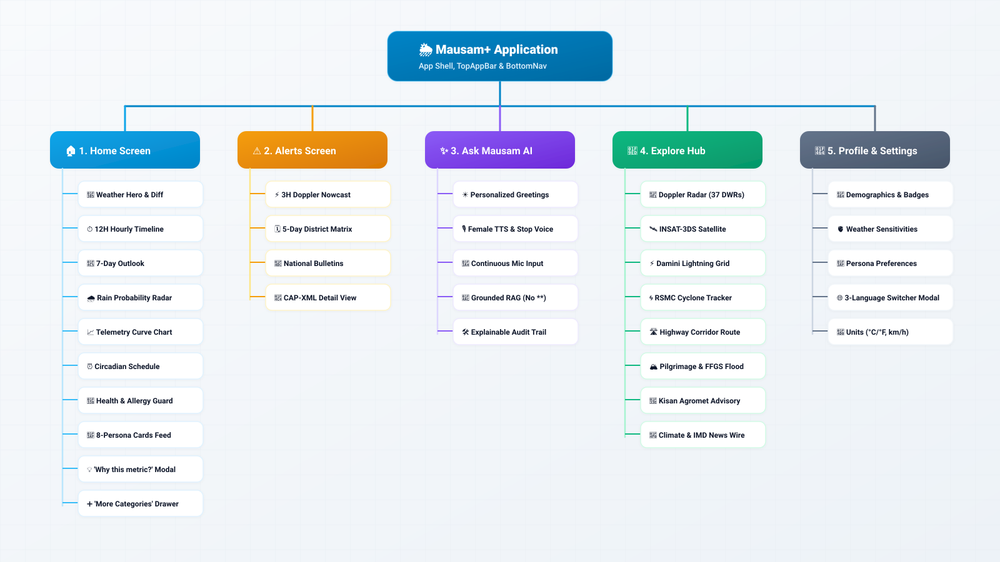
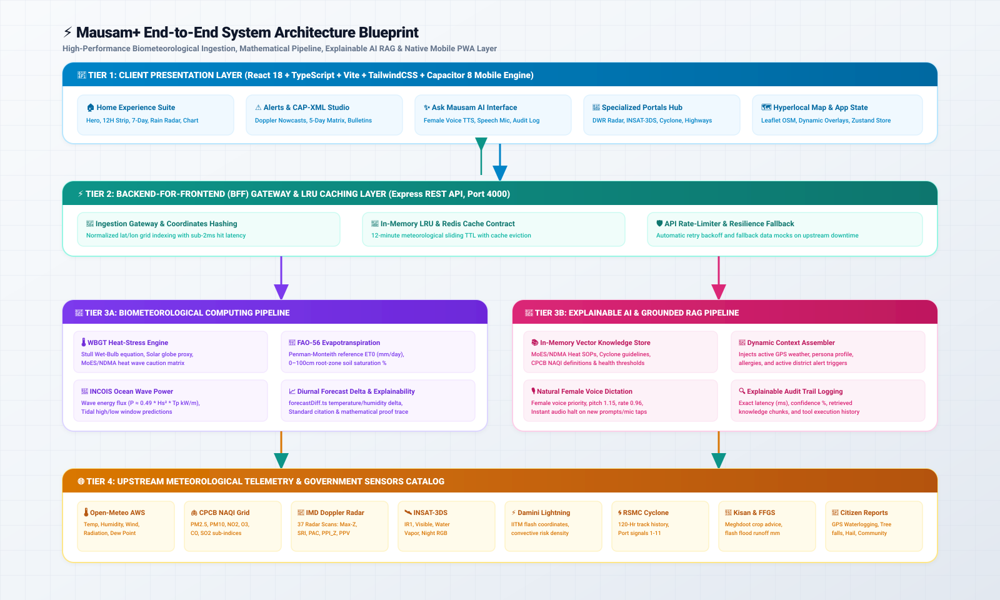

# 🌦️ Mausam+ — Explainable Biometeorological & Hyperlocal Weather Intelligence

> **Ministry of Earth Sciences (MoES) / India Meteorological Department (IMD)**  
> **Enterprise Monorepo:** React 18 + TypeScript + Vite + TailwindCSS + Capacitor 8 Mobile Engine + Node.js Express BFF + Redis Caching

---

## 🌟 Executive Summary

**Mausam+** transforms traditional, generic weather forecasts into a **hyper-personalized, biometeorological decision-support system**. Powered by real-time telemetry from the **India Meteorological Department (IMD)**, **Open-Meteo AWS**, **Central Pollution Control Board (CPCB)**, and **INCOIS Ocean Protocols**, Mausam+ calculates physiological heat strain (WBGT), reference evapotranspiration ($\text{ET}_0$), ocean wave energy flux, and hyperlocal micro-climate hazards.

Equipped with a grounded **Conversational AI RAG Assistant** featuring natural female voice synthesis, **37 Regional Doppler Weather Radars**, **INSAT-3DS Multi-Spectral Satellite channels**, **Damini Lightning convection grids**, **RSMC Tropical Cyclone tracking**, and **Sectoral Portals** (Highways, Pilgrimage Yatras, Flash Flood FFGS, and Kisan Agromet), Mausam+ provides transparent, explainable weather intelligence for 1.4 billion citizens.

---

## 🗺️ Master Visual Sitemap & Navigation Hierarchy

### Light Theme Sitemap


### Dark Theme Sitemap


---

## 🏗️ End-to-End System Architecture Blueprint

### Light Theme Architecture


### Dark Theme Architecture


---

## ✨ Core Feature Highlights

### 1. 🌅 Photorealistic Weather Hero & Telemetry Suite
- **Cinematic Atmospheric Backdrops**: Dynamic, photorealistic weather wallpapers (`hero_sunny`, `hero_rain`, `hero_cloudy`, `hero_thunder`, `hero_night`) that match real-world sky conditions.
- **Diurnal Delta Engine (`forecastDiff.ts`)**: Natural-language summaries comparing current conditions against yesterday's observed metrics.
- **Next 12-Hour Timeline Strip**: Compact hourly weather tiles with 3D condition glyphs, temperatures, and precipitation probability tags.
- **7-Day Meteorological Outlook**: Multi-day forecast with high/low temperature dividers, condition labels, and expandable sunrise/sunset/rain drawers.
- **Precipitation Probability Radar**: Real-time hourly rain chance timeline with animated gradient fill tracks (`framer-motion`).
- **Interactive Telemetry Curve Chart**: 12-hour Recharts area curve with metric view toggles (**All Metrics**, **Temperature Only**, **Rainfall Only**).
- **Smart Circadian Activity Schedule**: Automated daily planning advisor for Morning Cardio, Peak UV Sun window, and Evening Transit commute.

---

### 2. 🎯 Personalized Biometeorological Persona Cards Feed
Mausam+ calculates customized decision metrics for 8 distinct user personas:
1. **🫁 Air Quality & NAQI Card**: CPCB National Air Quality Index (0–500) with sub-index breakdown for $\text{PM}_{2.5}$, $\text{PM}_{10}$, $\text{NO}_2$, $\text{O}_3$, $\text{CO}$, $\text{SO}_2$.
2. **🌡️ Wet-Bulb Globe Temperature (WBGT) Heat Stress Card**: Outdoor physiological thermal load, sweat evaporation efficiency %, and hydration recommendation ($\text{L/hr}$) grounded in MoES/NDMA Heatwave Guidelines.
3. **🏃 Optimal Running & Cardio Window Card**: Thermal strain index and cardiovascular workout window safety ratings (0–100 score).
4. **🚗 Commute & Transit Radar Card**: Real-time road waterlogging factor, fog visibility index (meters), and multimodal transit advisories.
5. **🌊 Tide & Coastal Swell Card**: Swell wave energy flux ($\text{kW/m}$), significant wave height ($H_s$), wave period ($T_p$), and INCOIS high/low tidal windows.
6. **🌱 Agri & Soil Moisture Card**: FAO-56 Penman-Monteith reference evapotranspiration ($\text{ET}_0$ in $\text{mm/day}$), root-zone soil saturation (0–100cm), and crop irrigation advisories.
7. **🗓️ 5-Day District Warning Matrix Card**: Color-coded MoES disaster management warning grid (Green/Nil, Yellow/Watch, Orange/Alert, Red/Warning).
8. **⚡ Live 3-Hour Doppler Nowcast Card**: Immediate warnings for severe thunderstorms, squalls, and hailstorms.

---

### 3. 🧠 Grounded Ask Mausam AI & Natural Voice Engine
- **Time-Aware Personalized Salutations**: Dynamic morning/afternoon/evening greetings tailored to active language, city, and live temperature.
- **Natural Female Voice Dictation (TTS)**: High-quality, smooth female voice synthesis with tuned pitch (`1.15`) and cadence (`0.96`) across English, Hindi, and Kannada.
- **Audio Lifecycle Controls**: Instant **"Stop Voice"** button + automatic audio cancellation whenever a user speaks or submits a new prompt.
- **Zero Raw Asterisk Rendering**: In-app markdown parser converts bold syntax (`**text**`) into elegant HTML typography while keeping speech clean.
- **Explainable Audit Trail Drawer**: Inspectable generation telemetry including execution latency ($\text{ms}$), confidence rating %, and retrieved scientific citations.

---

### 4. 🧭 Specialized Remote Sensing & Sectoral Explore Hubs
All Explore Hub portals are **100% theme-adaptive** (Light & Dark mode):
- **📡 Doppler Radar Studio**: Interactive viewer for **37 Regional IMD Radars** with product layer selector (`MAX_Z`, `SRI`, `PAC`, `PPI_Z`, `PPV`, `VVP2`), 3-hour loop animations, and reflectivity dBZ legends.
- **🛰️ INSAT-3DS Satellite Studio**: Multi-spectral geostationary imagery across Infra-Red (`IR1`), Visible (`VIS`), Water Vapor (`WV`), and Night Microphysics RGB.
- **⚡ Damini Lightning Grid**: Ground-based sensor network mapping cloud-to-ground flash density and convective danger zones.
- **🌀 Cyclone & Maritime Safety Guard**: RSMC New Delhi tropical cyclone tracker with 120-hour track history, storm surge heights, fishermen deep-sea warnings, and commercial Port Danger Signals (1 to 11).
- **🛣️ Highway Corridor Weather**: Route forecasts, visibility index, and recommended safe speeds for major national highways (NH-48, NH-44, NH-16).
- **🕉️ Sacred Pilgrimage Yatras**: High-altitude weather, wind-chill, and trail passability status for Char Dham, Amarnath, and Vaishno Devi.
- **🌊 Flash Flood Guidance System (FFGS)**: Hydrometeorological catchment runoff threat ($\text{mm}$) and DRMS district rainfall departure percentages.
- **🌾 Kisan Agromet Advisory**: GKMS & Meghdoot district bulletins for crop spraying windows, pest management, and dairy livestock care.
- **📰 Climate & IMD News Wire**: Official verified meteorological press releases with category filters and bookmarking.

---

### 5. 🗺️ Hyperlocal Risk Map & Citizen Crowdsourcing
- **Interactive Leaflet Map**: Dynamic GPS user tracking with customizable overlays for Precipitation zones, Thermal Heat load, and CPCB Air Quality.
- **Crowd-sourced Hazard Pins**: Real-time pins for Waterlogging, Severe Heat, Air Pollution, Fallen Trees, Hailstorms, High Winds, and Dense Fog with numeric severity badges.
- **Community Verification**: In-app upvoting mechanism to validate active hazard reports.
- **Citizen Report Wizard (`/report`)**: Multi-step submission form with hazard categorization, severity slider, GPS auto-lock, description, and photo upload.

---

## 📁 Monorepo Structure

```
mausam-plus/
├── apps/
│   └── mobile/                       # React 18 + Vite + TS PWA & Capacitor Mobile Client
│       ├── public/weather/           # Photorealistic atmospheric hero wallpapers
│       ├── src/
│       │   ├── cards/                # 8 Persona & Specialized Weather Cards
│       │   ├── components/           # UI components (Header, TopAppBar, Nav, RainCard, DaysCard, etc.)
│       │   ├── locales/              # i18n JSON strings (English, हिन्दी, ಕನ್ನಡ)
│       │   ├── pages/                # Routed views (Home, Alerts, Ask, Radar, Cyclone, Map, Profile, etc.)
│       │   ├── services/             # VoiceService, API clients, Offline storage
│       │   └── store/                # Zustand App Store (Location, Theme, Personas, Allergies)
├── services/
│   └── bff/                          # Express + TypeScript Backend-For-Frontend
│       └── src/
│           ├── routes/               # REST API endpoints (/api/forecast, /api/ai, /api/imd/*)
│           └── services/             # Biometeorology math engine, RAG pipeline, Caching
├── packages/
│   ├── design-system/                # Shared theme tokens, CSS variables & typography
│   └── shared-types/                 # Canonical TypeScript models (Forecast, Alert, CitizenReport)
├── docs/
│   ├── assets/                       # Visual Sitemap & Architecture diagrams (SVG & JPG)
│   ├── SITEMAP_AND_ARCHITECTURE.md   # Comprehensive technical specification & tables
│   └── ARCHITECTURE.md               # BFF routing & data contract documentation
└── README.md                         # This document
```

---

## 🚀 Quickstart & Development Guide

### Prerequisites
- **Node.js**: `>= 18.x` (Tested on Node 20.x and 24.x)
- **npm**: `>= 9.x`

### 1. Installation
Clone the repository and install workspace dependencies:
```bash
git clone https://github.com/ani18cs/mausam-plus.git
cd mausam-plus
npm install
```

### 2. Environment Configuration
Create your local `.env` file from the provided template:
```bash
cp .env.example .env
```

### 3. Start Development Servers

**Run Both Frontend & Backend Concurrently:**
```bash
npm run dev:all
```

**Or Run Individually:**
- **Mobile Frontend (Vite):**
  ```bash
  npm run dev:mobile
  # Accessible at http://localhost:5173
  ```
- **Backend-For-Frontend (Express):**
  ```bash
  npm run dev:bff
  # Accessible at http://localhost:4000
  ```

---

## 📡 Upstream Telemetry Ingestion Catalog

| Telemetry Data Stream | Source Organization | Telemetry Parameters Ingested | Ingestion Interval | Used By Components |
| :--- | :--- | :--- | :--- | :--- |
| **Surface Meteorology & Solar** | Open-Meteo / IMD AWS | Air Temp ($T_a$), Relative Humidity ($RH$), Wind Speed ($u_{10}$), Wind Direction ($^\circ$), Solar Radiation ($R_s$), Dew Point ($T_d$), Surface Pressure ($P$), Precipitation Probability (%). | Real-Time / 12-min cache TTL | Weather Hero, Hourly Strip, 7-Day Forecast, WBGT Heat-Stress, $\text{ET}_0$ Soil Moisture, Running Window, Commute Radar. |
| **Air Quality & Particulate** | CPCB / Open-Meteo Air Quality | $\text{PM}_{2.5}$, $\text{PM}_{10}$, $\text{NO}_2$, $\text{O}_3$, $\text{CO}$, $\text{SO}_2$, CPCB NAQI sub-index computation. | Hourly | Air Quality Card, Health & Allergy AI Guard, Hyperlocal Risk Map AQI overlay. |
| **Doppler Weather Radar (DWR)** | IMD Doppler Radar Network | Reflectivity Max-Z ($\text{dBZ}$), Surface Rainfall Intensity (SRI $\text{mm/hr}$), Cumulative Precipitation (PAC $\text{mm}$), Radial Velocity (PPV $\text{m/s}$), Wind Profile (VVP2). | 10 minutes | Radar & Satellite Studio (`/radar`), Live 3-Hour Nowcast Warnings Card. |
| **Geostationary Satellite Imagery** | ISRO / IMD INSAT-3DS | Infra-Red 1 ($10.8\,\mu\text{m}$), Visible ($0.65\,\mu\text{m}$), Water Vapor ($6.9\,\mu\text{m}$), Night Microphysics RGB composite. | 15–30 minutes | Radar & Satellite Studio (`/radar`). |
| **Lightning Flash Density** | IITM / IMD Damini Network | Cloud-to-ground lightning flash coordinates, strike density count, convective storm severity probability. | 5 minutes | Lightning Grid (`/radar`), Outdoor Running Card, Alert Details. |
| **Tropical Cyclone & Marine** | RSMC New Delhi / IMD | Cyclone name, basin, intensity category, central pressure ($\text{hPa}$), max sustained wind ($\text{km/h}$), 120-hour track points, landfall projection, storm surge height ($\text{m}$), port danger signals (1–11), fishermen advisories. | Real-time on active bulletin | Cyclone & Coastal Guard (`/cyclone`), Tide & Coastal Swell Card. |
| **Ocean Waves & Coastal Swell** | INCOIS Ocean Protocol | Significant wave height ($H_s$), peak wave period ($T_p$), swell energy flux ($P \approx 0.49 H_s^2 T_p\,\text{kW/m}$), high/low tidal predictions. | 30 minutes | Tide & Coastal Swell Card (`TideCard.tsx`). |
| **Highway Corridor Weather** | IMD Highway Weather Division | Route-wise visibility ($\text{m}$), road surface rainfall status, fog hazard alerts, safe speed recommendations ($\text{km/h}$). | 15 minutes | Specialized Forecast Hub (`/specialized` -> Highways). |
| **Pilgrimage Mountain Weather** | IMD Mountain Meteorological Center | Camp altitude ($\text{m}$ MSL), ambient temperature, wind chill ($^\circ\text{C}$), rain/snow conditions, trail passability status (Open/Caution/Blocked). | Hourly | Specialized Forecast Hub (`/specialized` -> Pilgrimage). |
| **Flash Flood Guidance (FFGS)** | IMD Hydromet Division | Flash flood threat ($\text{mm}$ excess runoff), root-zone soil saturation (%), district rainfall monitoring departures (DRMS %). | 3 hours | Specialized Forecast Hub (`/specialized` -> Flash Flood). |
| **Kisan Agromet Advisories** | GKMS / Meghdoot Division | District-wise crop growth stages, spraying feasibility windows, irrigation guidance, pest/disease alerts, dairy livestock care. | Bi-weekly bulletins | Specialized Forecast Hub (`/specialized` -> Kisan Agro), Agri Soil Moisture Card. |
| **Crowd-sourced Incident Reports** | Mausam+ Citizen Network | GPS coordinates, hazard category (Waterlogging, Fallen Tree, Hail, Heat, Smoke), severity level, descriptive notes, community upvotes. | Real-time stream | Hyperlocal Risk Map (`/map`), Citizen Report Wizard (`/report`). |

---


## 📄 License & Attribution
* **Developed for**: Ministry of Earth Sciences (MoES) / India Meteorological Department (IMD)
* **License**: MIT License. Open-source contribution under MoES Weather Data Guidelines.
