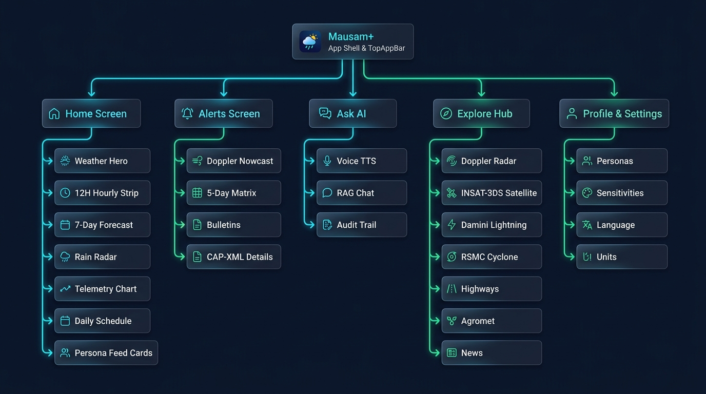
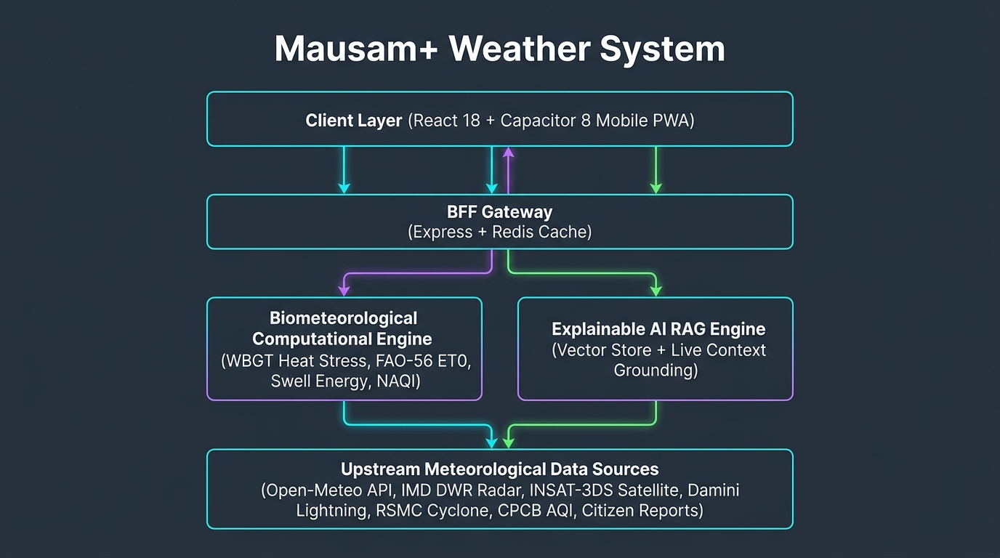
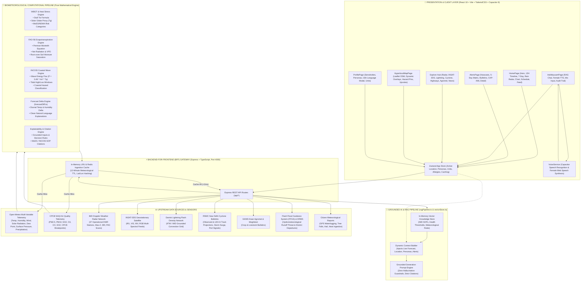

# 🗺️ Mausam+ Complete Sitemap, Architecture & Technical Specification

This document provides an exhaustive structural blueprint of the **Mausam+** biometeorological platform. It details all navigation nodes, interactive UI components, persona cards, backend computational pipelines, and real-time telemetry data sources.

---

## 1. 🌐 Master Visual Sitemap & Screen Hierarchy

### Interactive Structural Flowchart (Mermaid)

```mermaid
graph TD
    %% Root Container & Shell
    AppShell["📱 Mausam+ Application Shell<br/>(TopAppBar + Dynamic BottomBar)"]

    %% Top App Bar Interactions
    TopBar["🔝 TopAppBar<br/>(Logo, City Selector, Status Indicator, Theme Toggle, Search)"]
    AppShell --> TopBar
    TopBar --> LocationDropdown["📍 Saved Places Dropdown<br/>(/saved-places)"]
    TopBar --> ThemeSwitcher["🌓 Dark/Light Mode Switcher"]
    TopBar --> GlobalSearch["🔍 Geocoding City Search"]

    %% 5 Peer Root Navigation Tabs
    AppShell --> TabHome["🏠 1. Home Screen<br/>(/home)"]
    AppShell --> TabAlerts["⚠️ 2. Alerts Screen<br/>(/alerts)"]
    AppShell --> TabAskAI["✨ 3. Ask AI Screen<br/>(/ask)"]
    AppShell --> TabExplore["🧭 4. Explore Hub<br/>(/explore)"]
    AppShell --> TabProfile["👤 5. Profile & Settings<br/>(/profile)"]

    %% Other Main Routes
    AppShell --> RouteMap["🗺️ Hyperlocal Risk Map<br/>(/map)"]
    AppShell --> RouteReport["📢 Report Hazard Wizard<br/>(/report)"]
    AppShell --> RouteSavedPlaces["⭐ Saved Places Manager<br/>(/saved-places)"]
    AppShell --> RouteOnboarding["🚀 Onboarding Flow<br/>(/onboarding)"]

    %% ==========================================
    %% TAB 1: HOME PAGE MODULES & CARDS
    %% ==========================================
    TabHome --> HeroWeather["🌅 Photorealistic Weather Hero<br/>(Condition Wallpaper, City, Temp °C/°F, Lottie Graphic, Diff vs Yesterday, Quick Metrics)"]
    TabHome --> HourlyForecast["⏱️ Hourly Forecast Strip<br/>(Next 12 Hours, 3D Glyphs, Rain Risk Tags)"]
    TabHome --> DaysForecast["📅 7-Day Meteorological Outlook<br/>(High/Low Dividers, 3D Icons, Sunrise/Sunset Expanders)"]
    TabHome --> RainRadarCard["🌧️ Precipitation Probability Radar<br/>(Animated Progress Tracks & Time Markers)"]
    TabHome --> TelemetryChart["📈 12-Hour Telemetry Curve<br/>(Area Curves, Temp/Rain/All View Toggles)"]
    TabHome --> SmartSchedule["⏰ Smart Daily Activity Schedule<br/>(Morning Cardio, UV Peak, Commute Windows)"]
    TabHome --> HealthGuard["🌸 Personal Health Alerts<br/>(Pollen, PM2.5 Dust, Asthma, Heat Strain)"]
    TabHome --> PersonaFeed["🎯 Personalized Persona Cards Feed<br/>(Customizable & Reorderable)"]

    %% Persona Feed Cards
    PersonaFeed --> CardAQI["🫁 Air Quality & NAQI Card<br/>(CPCB AQI, PM2.5, PM10, Sub-indices)"]
    PersonaFeed --> CardHeat["🌡️ Biometeorological Heat-Stress Card<br/>(Outdoor WBGT, Thermal Category, Hydration Target)"]
    PersonaFeed --> CardRunning["🏃 Running & Workout Window Card<br/>(Comfort Score, Best Time Window, Strain Level)"]
    PersonaFeed --> CardCommute["🚗 Commute & Transit Radar Card<br/>(Road Surface Waterlogging, Visibility Index)"]
    PersonaFeed --> CardTide["🌊 Tide & Coastal Swell Card<br/>(INCOIS Wave Power, Tidal Windows, Coastal Alert)"]
    PersonaFeed --> CardAgri["🌱 Agri & Soil Moisture Card<br/>(FAO-56 ET0, Root-zone Saturation, Irrigation Need)"]
    PersonaFeed --> CardWarning5Day["🗓️ 5-Day District Warning Matrix Card<br/>(Color-coded MoES Warning Matrix)"]
    PersonaFeed --> CardNowcast["⚡ 3-Hour Doppler Nowcast Card<br/>(Live Severe Thunderstorm/Squall Warning)"]

    %% Home Modals & Drawers
    TabHome --> WhyModal["💡 'Why this metric?' Modal<br/>(Grounded Formula, Telemetry Inputs, Standard Citations)"]
    TabHome --> MoreCategoriesDrawer["➕ 'More Categories' Drawer<br/>(Unselected Persona Cards with 'Pin to Home')"]

    %% ==========================================
    %% TAB 2: ALERTS SCREEN MODULES
    %% ==========================================
    TabAlerts --> SubTabAlerts["🔴 Active District Nowcasts & Warnings"]
    TabAlerts --> SubTabBulletins["📜 Official IMD National Weather Bulletins"]
    SubTabAlerts --> AlertDetailPage["📄 Alert Detail View<br/>(/alert/:id)<br/>(CAP-XML Payload, Impact Severity, Safety Actions, Share)"]

    %% ==========================================
    %% TAB 3: ASK AI ASSISTANT
    %% ==========================================
    TabAskAI --> AISalutation["☀️ Time-Aware Personalized Greeting<br/>(Morning/Afternoon/Evening, Locale-Specific)"]
    TabAskAI --> AIChatFeed["💬 Grounded RAG Chat Interface<br/>(Zero Raw Markdown Asterisks, Formatted Text)"]
    TabAskAI --> AIVoiceTTS["🎙️ Female Voice Dictation Engine<br/>(Natural Tone, 'Stop Voice' Audio Controls)"]
    TabAskAI --> AIVoiceInput["🎤 Voice Recognition Mic Button<br/>(Continuous Speech-to-Text)"]
    TabAskAI --> AIAuditTrail["🛠️ Explainable Audit Trail Drawer<br/>(Latency, Confidence %, Retrieved Knowledge Chunks)"]

    %% ==========================================
    %% TAB 4: EXPLORE HUB PORTALS
    %% ==========================================
    TabExplore --> PortalRadar["📡 Doppler Radar & Satellite Studio<br/>(/radar)"]
    TabExplore --> PortalCyclone["🌀 Cyclone & Maritime Safety Guard<br/>(/cyclone)"]
    TabExplore --> PortalSpecialized["🏔️ Specialized Forecast Hub<br/>(/specialized)"]
    TabExplore --> PortalNews["📰 Climate & IMD News Wire<br/>(/news)"]
    TabExplore --> PortalMapLink["🗺️ Interactive Hyperlocal Risk Map<br/>(/map)"]
    TabExplore --> PortalReportLink["📢 Citizen Weather Report Wizard<br/>(/report)"]

    %% Explore Sub-Pages
    PortalRadar --> RadarSub1["37 DWR Station Scans & Reflectivity Legend"]
    PortalRadar --> RadarSub2["INSAT-3DS Multi-Spectral Satellite Imagery"]
    PortalRadar --> RadarSub3["Damini Lightning Flash Density Grid"]

    PortalCyclone --> CycloneSub1["RSMC Cyclone Tracker & 120-Hr Track History"]
    PortalCyclone --> CycloneSub2["Fishermen Deep-Sea Advisory & State Warnings"]
    PortalCyclone --> CycloneSub3["Commercial Port Signal Matrix (Signals 1 to 11)"]

    PortalSpecialized --> SpecSub1["🛣️ Highway Corridors (NH-48, NH-44, etc.)"]
    PortalSpecialized --> SpecSub2["🕉️ Sacred Pilgrimage Yatras (Char Dham, Amarnath)"]
    PortalSpecialized --> SpecSub3["🌊 Flash Flood Guidance System (FFGS) & DRMS"]
    PortalSpecialized --> SpecSub4["🌾 Kisan Agromet GKMS Meghdoot Advisory"]

    PortalNews --> NewsSearch["🔍 Article Search & Category Filters (Monsoon, Heat, AQI)"]
    PortalNews --> NewsBookmarks["🔖 Saved News Articles & Official IMD Feed"]

    %% ==========================================
    %% TAB 5: PROFILE & SETTINGS
    %% ==========================================
    TabProfile --> UserCard["👤 Citizen Demographics & Verified Badge"]
    TabProfile --> AllergyManager["🫀 Weather Sensitivities & Health Toggle"]
    TabProfile --> PersonaSelector["🎯 8-Persona Preference Manager"]
    TabProfile --> LanguageSwitcher["🌐 3-Language Switcher Modal (EN, HI, KN)"]
    TabProfile --> UnitSwitcher["📐 Units of Measurement (Celsius/Fahrenheit, kph/mph/mps/kts)"]
    TabProfile --> OnboardingReset["🔄 Reset Onboarding & Live Demo Trigger"]
```

---

## 2. 📋 Comprehensive Component & Screen Information Table

| Module / Screen | Route | Key Features & UX Components | Telemetry / Computational Source | User Actions |
| :--- | :--- | :--- | :--- | :--- |
| **Top App Bar** | Global (`*`) | City name display, live Doppler status beacon, location selector, global search button, theme toggle. | State store (`activeLocation`, `theme`), BFF geocoding API. | Switch city, toggle Dark/Light mode, launch search. |
| **Bottom Nav Bar** | Global (`*`) | 5 Root Peer Tabs (`Home`, `Alerts`, `Ask AI`, `Explore`, `Profile`) with active badges and spring micro-animations. | React Router DOM + Framer Motion. | Peer tab switching. |
| **Photorealistic Weather Hero** | `/home` | Real-world cinematic atmospheric background, day/date badge, condition title, single-degree temperature display, Lottie weather graphic, diff vs yesterday, and 3 core environmental pills (Humidity, Wind direction arrow, UV Index). | Open-Meteo Multi-Variable API, `forecastDiff.ts` engine, live telemetry cache. | Refresh weather, tap diff for details, view warnings. |
| **Hourly Forecast Strip** | `/home` | Next 12-hour horizontal scroll strip with time markers, 3D weather icons, temperatures, and rain risk tags. | Open-Meteo hourly telemetry. | Horizontal scroll & inspection. |
| **7-Day Meteorological Outlook** | `/home` | Multi-day list with day/date, high/low temperature dividers, 3D weather icons, and expandable sunrise/sunset/rain drawers. | Open-Meteo daily telemetry + IMD forecasts. | Tap to expand/collapse sunrise/sunset/rain details. |
| **Precipitation Radar Card** | `/home` | Hourly precipitation probability timeline with smooth animated gradient fill bars (`framer-motion`) and percentage indicators. | Hourly probability calculation. | Visual scan of rain window. |
| **12-Hour Telemetry Curve** | `/home` | Interactive Recharts area chart with metric view toggles (**All**, **Temp**, **Rain**) and custom touch tooltips. | Hourly temperature and precipitation curve. | Toggle metric curves, hover/touch data points. |
| **Smart Activity Schedule** | `/home` | AI-derived daily routine scheduler for Morning Cardio, Peak UV Sun window, and Evening Transit commute with status tags. | Biometeorological calculation engine + circadian rules. | Read safety window advisories. |
| **Health & Allergy AI Guard** | `/home` | Real-time vulnerability alert tiles for Pollen spikes, PM2.5/PM10 dust, Asthma triggers, and Wet-Bulb heat stress. | CPCB NAQI Air Quality + WBGT heat stress thresholds + profile preferences. | Review personalized medical precautions. |
| **Air Quality & NAQI Card** | `/home` (Feed) | Central CPCB NAQI gauge (0–500), prominent category pill (Good to Severe), sub-index breakdown for $\text{PM}_{2.5}$, $\text{PM}_{10}$, $\text{NO}_2$, $\text{O}_3$, $\text{CO}$, $\text{SO}_2$, and health advisory. | CPCB / Open-Meteo Air Quality API with linear breakpoint interpolation. | Tap "Why this metric?", reorder card. |
| **Physiological Heat-Stress Card** | `/home` (Feed) | Outdoor Wet-Bulb Globe Temperature (WBGT) gauge, MoES/NDMA heat wave safety category, sweat evaporation efficiency %, and hydration recommendation (L/hr). | Pure mathematical WBGT calculation (`services/biometeorology.ts`, Stull equation). | Tap "Why this metric?", review hydration targets. |
| **Optimal Running Window Card** | `/home` | Diurnal workout window advisor (0–100 score), best time slot, thermal strain index, and cardiovascular safety rating. | Running window optimization engine based on wet-bulb temperature, solar radiation, and AQI. | Plan morning/evening fitness activities. |
| **Commute & Transit Radar Card** | `/home` | Rain delay factor (0–100%), surface waterlogging risk, fog visibility index (meters), and multimodal transit advice. | Open-Meteo hourly rain + visibility sensors. | Plan transit and commute routes. |
| **Tide & Coastal Swell Card** | `/home` | Swell wave energy flux ($\text{kW/m}$), wave height ($H_s$), wave period ($T_p$), high/low tide timeline, and INCOIS coastal hazard warning. | INCOIS Ocean Protocol & swell wave energy formula ($P \approx 0.49 H_s^2 T_p$). | Marine planning, coastal recreation safety. |
| **Agri & Soil Moisture Card** | `/home` | FAO-56 Penman-Monteith reference evapotranspiration ($\text{ET}_0$ in $\text{mm/day}$), 0–100cm root-zone soil moisture saturation %, and irrigation need indicator. | FAO-56 Evapotranspiration formula + net radiation + vapor pressure deficit. | Agricultural irrigation scheduling. |
| **5-Day District Warning Matrix** | `/home` | Color-coded IMD district warning grid (Green/Nil, Yellow/Watch, Orange/Alert, Red/Warning) across 5 consecutive days. | IMD National Weather Service District Bulletins. | Long-term disaster preparedness. |
| **Live 3-Hour Nowcast Warnings** | `/home` | Real-time Doppler severe thunderstorm, squall, and hailstorm nowcasts with exact affected taluks and expiry time. | IMD Doppler Radar Nowcast Network. | Immediate severe weather action. |
| **'Why this metric?' Modal** | `/home` (Modal) | Explainable AI drawer showing observed sensor values, applied mathematical formula, standard citation, and reasoning trace. | Biometeorology calculation metadata & IMD SOP documentation. | Inspect mathematical formulas and evidence citations. |
| **'More Categories' Drawer** | `/home` | Collapsible section containing unselected persona cards with individual "Pin to Home" buttons. | Card Registry + App State. | Add/remove cards from personal daily feed. |
| **Alerts & Warnings Screen** | `/alerts` | Tabbed view of active nowcasts, district warnings, and official IMD National Weather Bulletins with search and filter. | IMD Warning Bulletin Feed (`/api/imd/warnings`, `/api/imd/nowcast`). | Tap alert for full CAP-XML detail view. |
| **Alert Detail View** | `/alert/:id` | Full CAP-XML alert parameters, severity color banners, affected districts list, recommended citizen actions, and native Web Share. | Common Alerting Protocol (CAP-XML) parser. | Share alert, copy advisory text. |
| **Ask Mausam AI** | `/ask` | Grounded conversational AI assistant with time-aware personalized greetings, formatted responses (no raw `**` asterisks), smooth female TTS dictation, speech-to-text mic input, and expandable tool execution audit trail. | BFF RAG Pipeline + Live Forecast Context + In-Memory Vector Store + Web Speech / Capacitor TTS. | Ask natural language questions, listen to audio, toggle mic, inspect audit trail. |
| **Doppler Radar & Satellite Studio** | `/radar` | 37 Regional Doppler Weather Radars with product layer selector (`MAX_Z`, `SRI`, `PAC`, `PPI_Z`, `PPV`, `VVP2`), 3-hour animation loop, INSAT-3DS multi-spectral satellite channels (`IR1`, `VIS`, `WV`, `RGB`), and Damini Lightning flash density grid. All fully theme-adaptive. | IMD Remote Sensing Network (`/api/imd/remote-sensing`) + INSAT-3DS + Damini Network. | Switch radar stations, toggle 3-hr animation loop, switch satellite channels, view lightning risk. |
| **Cyclone & Coastal Guard** | `/cyclone` | RSMC New Delhi tropical cyclone tracking, observed vs. 120-hour forecast track points, landfall projection ETA, storm surge height, state-wise Fishermen deep-sea advisories, and commercial Port Warning Signals (Signals 1 to 11). | RSMC Tropical Cyclone Bulletins (`/api/imd/cyclone`, `/api/imd/marine`). | Track active storms, check sea state, verify port danger signals. |
| **Specialized Forecast Hub** | `/specialized` | Sectoral weather portals for **Highways** (NH-48, NH-44 segment forecasts and speed advisories), **Sacred Pilgrimage Yatras** (Char Dham, Amarnath camp altitudes and trail passability), **Flash Flood Guidance (FFGS)** with DRMS departure percentages, and **Kisan Agromet** (GKMS Meghdoot crop & livestock guidance). | Specialized Sectoral APIs (`/api/imd/highways`, `/api/imd/pilgrimage`, `/api/imd/flash-flood`, `/api/imd/agromet`). | Check corridor speed recommendations, trail status, runoff threats, crop spray windows. |
| **Climate & IMD News Wire** | `/news` | Verified IMD meteorological news bulletins with category filter chips (`Monsoon`, `Heatwave`, `AQI`, `Cyclone`, `IMD Advisory`), live wire ticker, search, and bookmarking. | Official IMD Press Releases & National Weather Bulletins (`/api/imd/news`). | Search news, filter categories, save bookmarks. |
| **Hyperlocal Risk Map** | `/map` | Interactive Leaflet map with GPS user location, Dynamic Rain/Heat/AQI circle overlays, crowd-sourced hazard pins with numeric badges, popup details, and upvoting mechanism. | Leaflet OpenStreetMap + BFF Crowd-sourced Reports Feed (`/api/reports`). | Pan/zoom map, filter hazard types, upvote verified hazards, tap + Report. |
| **Citizen Report Wizard** | `/report` | Multi-step crowd-sourcing submission form with hazard category selection, severity slider (Low to Critical), GPS location auto-lock, description, and photo upload. | BFF Reports Ingestion API (`POST /api/reports`). | Submit verified real-time weather incidents. |
| **Saved Places Manager** | `/saved-places` | Search & geocoding autocomplete for 500+ Indian districts and global cities, multi-city pinned cards with live temperature previews, and one-tap default city selector. | Open-Meteo / Nominatim Geocoding API (`/api/geocoding/search`). | Add/remove saved cities, switch active location. |
| **Profile & Settings** | `/profile` | Citizen demographics card (Name, Age, Gender, City, Phone), Health & sensitivity checkboxes, 8 active persona toggles, 3-language confirmation modal (EN, HI, KN), and measurement unit switchers. | LocalStorage + App State. | Edit profile, select personas, change language, switch temperature/wind units. |
| **Language Confirmation Modal** | `/profile` (Modal) | Confirmation dialog explaining UI and advisory translation effects before switching between English, हिन्दी, and ಕನ್ನಡ. | `i18next` localized strings (`lang_modal`). | Confirm or cancel language transition. |
| **Onboarding Flow** | `/onboarding` | 4-step first-time citizen introduction wizard covering features, persona selection, location access, and sensitivity setup. | App State onboarding flags. | Complete initial setup. |

---

## 3. 🏗️ End-to-End System Architecture Blueprint

### Interactive Architectural Flowchart (Mermaid)

---

## 4. 📡 Telemetry & Ingestion Data Sources Catalog

| Telemetry Data Stream | Source Organization | Telemetry Parameters Ingested | Ingestion Interval | Used By Components |
| :--- | :--- | :--- | :--- | :--- |
| **Surface Meteorology & Solar** | Open-Meteo / IMD AWS | Air Temp ($T_a$), Relative Humidity ($RH$), Wind Speed ($u_{10}$), Wind Direction ($^\circ$), Solar Radiation ($R_s$), Dew Point ($T_d$), Surface Pressure ($P$), Precipitation Probability (%). | Real-Time / 12-min cache TTL | Weather Hero, Hourly Strip, 7-Day Forecast, WBGT Heat-Stress, $\text{ET}_0$ Soil Moisture, Running Window, Commute Radar. |
| **Air Quality & Particulate** | CPCB / Open-Meteo Air Quality | $\text{PM}_{2.5}$, $\text{PM}_{10}$, $\text{NO}_2$, $\text{O}_3$, $\text{CO}$, $\text{SO}_2$, CPCB NAQI sub-index computation. | Hourly | Air Quality Card, Health & Allergy AI Guard (Dust/Asthma triggers), Hyperlocal Risk Map AQI overlay. |
| **Doppler Weather Radar (DWR)** | IMD Doppler Radar Network | Reflectivity Max-Z ($\text{dBZ}$), Surface Rainfall Intensity (SRI $\text{mm/hr}$), Cumulative Precipitation (PAC $\text{mm}$), Radial Velocity (PPV $\text{m/s}$), Wind Profile (VVP2). | 10 minutes | Radar & Satellite Studio (`/radar`), Live 3-Hour Nowcast Warnings Card. |
| **Geostationary Satellite Imagery** | ISRO / IMD INSAT-3DS | Infra-Red 1 ($10.8\,\mu\text{m}$), Visible ($0.65\,\mu\text{m}$), Water Vapor ($6.9\,\mu\text{m}$), Night Microphysics RGB composite. | 15–30 minutes | Radar & Satellite Studio (`/radar`). |
| **Lightning Flash Density** | IITM / IMD Damini Network | Cloud-to-ground lightning flash coordinates, strike density count, convective storm severity probability. | 5 minutes | Lightning Grid (`/radar`), Outdoor Running Card, Alert Details. |
| **Tropical Cyclone & Marine** | RSMC New Delhi / IMD | Cyclone name, basin, intensity category, central pressure ($\text{hPa}$), max sustained wind ($\text{km/h}$), 120-hour track points, landfall projection, storm surge height ($\text{m}$), port danger signals (1–11), fishermen advisories. | Real-time on active bulletin | Cyclone & Coastal Guard (`/cyclone`), Tide & Coastal Swell Card. |
| **Ocean Waves & Coastal Swell** | INCOIS Ocean Protocol | Significant wave height ($H_s$), peak wave period ($T_p$), swell energy flux ($P \approx 0.49 H_s^2 T_p\,\text{kW/m}$), high/low tidal predictions. | 30 minutes | Tide & Coastal Swell Card (`TideCard.tsx`). |
| **Highway Corridor Weather** | IMD Highway Weather Division | Route-wise visibility ($\text{m}$), road surface rainfall status, fog hazard alerts, safe speed recommendations ($\text{km/h}$). | 15 minutes | Specialized Forecast Hub (`/specialized` -> Highways). |
| **Pilgrimage Mountain Weather** | IMD Mountain Meteorological Center | Camp altitude ($\text{m}$ MSL), ambient temperature, wind chill ($^\circ\text{C}$), rain/snow conditions, trail passability status (Open/Caution/Blocked). | Hourly | Specialized Forecast Hub (`/specialized` -> Pilgrimage). |
| **Flash Flood Guidance (FFGS)** | IMD Hydromet Division | Flash flood threat ($\text{mm}$ excess runoff), root-zone soil saturation (%), district rainfall monitoring departures (DRMS %). | 3 hours | Specialized Forecast Hub (`/specialized` -> Flash Flood). |
| **Kisan Agromet Advisories** | GKMS / Meghdoot Division | District-wise crop growth stages, spraying feasibility windows, irrigation guidance, pest/disease alerts, dairy livestock care. | Bi-weekly bulletins | Specialized Forecast Hub (`/specialized` -> Kisan Agro), Agri Soil Moisture Card. |
| **Crowd-sourced Incident Reports** | Mausam+ Citizen Network | GPS coordinates, hazard category (Waterlogging, Fallen Tree, Hail, Heat, Smoke), severity level, descriptive notes, community upvotes. | Real-time stream | Hyperlocal Risk Map (`/map`), Citizen Report Wizard (`/report`). |
| **Grounded AI Knowledge Base** | MoES / NDMA SOPs / WMO Standards | Standard operating procedures for Heat Waves, Cyclone Response protocols, CPCB Air Quality Guidelines, WHO Pollen criteria, FAO-56 irrigation standards. | Static embedded vector store | Ask Mausam AI (`/ask`), "Why this metric?" Explainability Modal. |
